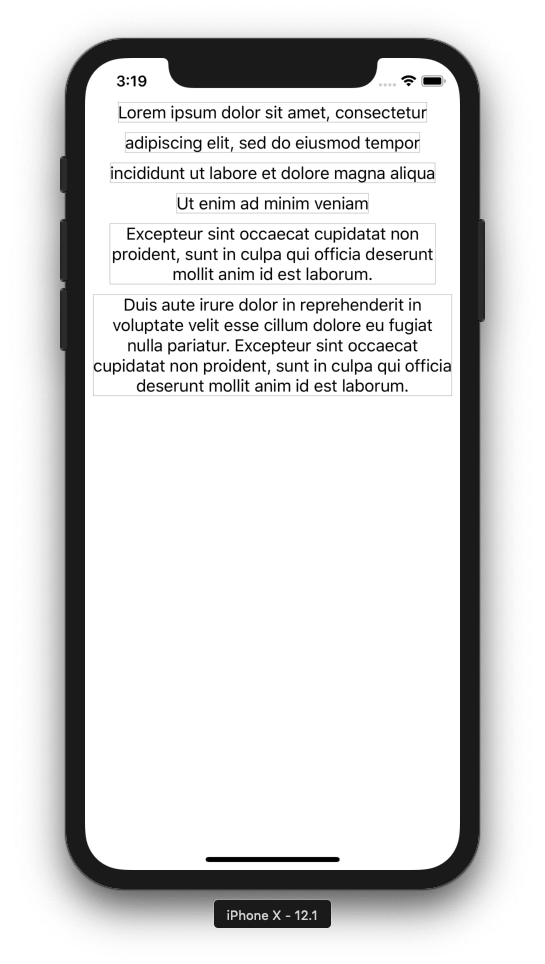

# CollectionViewSelfSizing-Final

The project demonstrates how to enable automatic self-sizing for collection view cells by means of Auto Layout.

    

See blog post 'Collection View Cells Self-Sizing' for more details: http://www.vadimbulavin.com/collection-view-cells-self-sizing/
